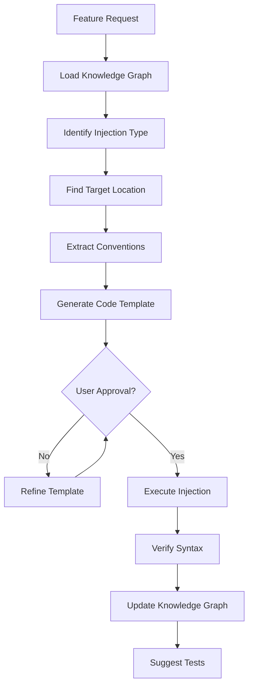

# Code Generation Templates

## Service Pattern

```typescript
// Following project conventions for services
export class {Name}Service {
  constructor(
    private {dependency}: {DependencyType}
  ) {}

  async {action}({params}): Promise<{ReturnType}> {
    // Implementation
  }
}
```

## Repository Pattern

```typescript
// Following project conventions for repositories
export interface {Name}Repository {
  findById(id: {IdType}): Promise<{Entity} | null>;
  save(entity: {Entity}): Promise<void>;
  delete(id: {IdType}): Promise<void>;
}

export class {Name}RepositoryImpl implements {Name}Repository {
  constructor(private db: DatabaseConnection) {}

  // Implementations...
}
```

## Controller/Handler Pattern

```typescript
// Following project conventions for handlers
export class {Name}Handler {
  constructor(private {service}: {ServiceType}) {}

  async handle{Action}(request: {RequestType}): Promise<{ResponseType}> {
    // Validation
    // Business logic delegation
    // Response mapping
  }
}
```

---

## Injection Workflow Diagram



---

## Error Recovery

| Error | Recovery Action |
|-------|-----------------|
| Syntax error after injection | Rollback using Serena's replace |
| Import conflict | Add alias or choose different name |
| Name collision | Rename with convention-matching alternative |
| Type mismatch | Analyze dependencies and fix types |

---

## Integration with Knowledge Graph

After successful injection:

1. **Update Symbol Registry**
   - Add new symbol to knowledge graph
   - Update dependency edges

2. **Update Pattern Registry**
   - Register if following known pattern
   - Note any new patterns introduced

3. **Update Convention Registry**
   - Validate conventions were followed
   - Note any deviations for review
