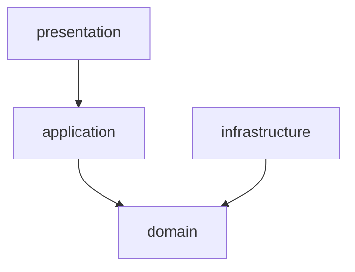
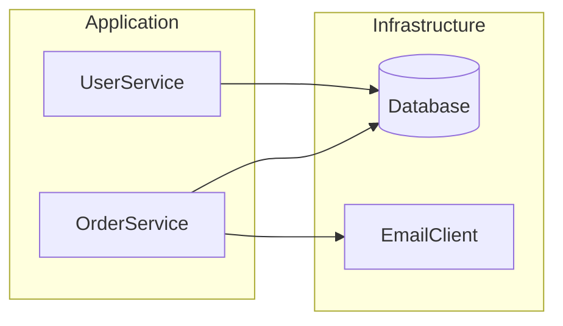
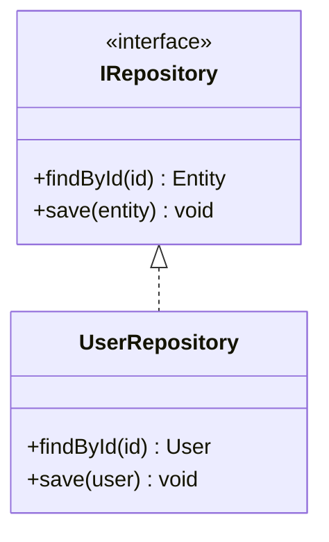
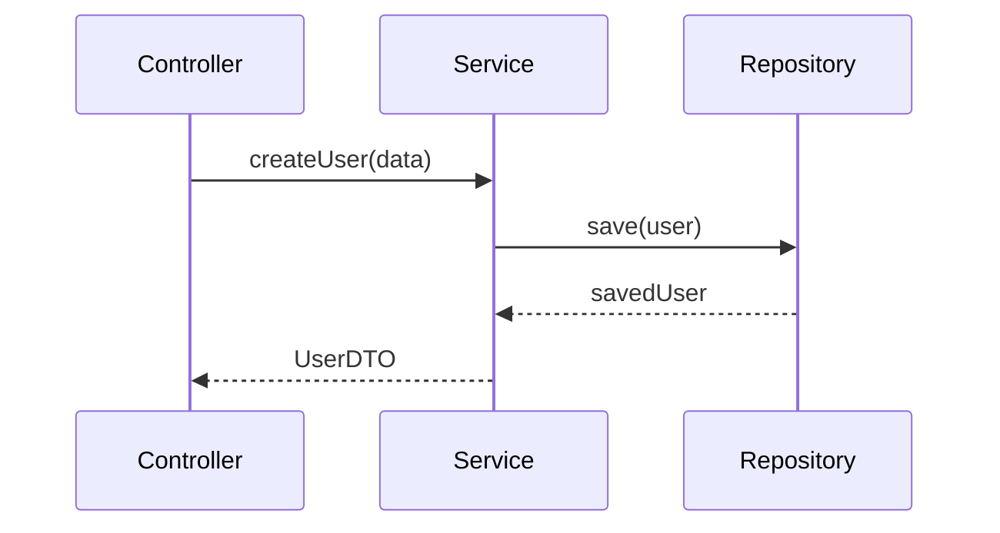
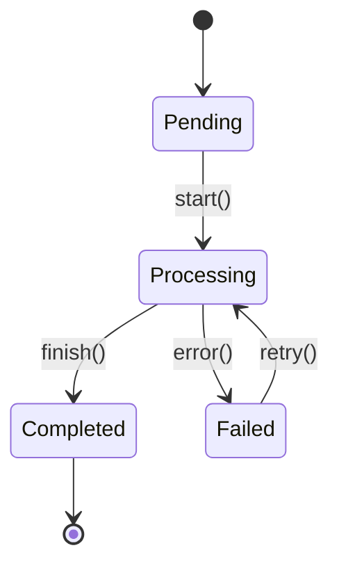

# Knowledge Graph Templates

## Standard Graph Formats

Templates for structuring extracted project knowledge.

---

## 1. Project Overview Template

```markdown
# Project: [PROJECT_NAME]
Generated: [TIMESTAMP]
Analyzer: Serena MCP

## Summary
- **Language(s)**: [LANGUAGES]
- **Framework(s)**: [FRAMEWORKS]
- **Total Files**: [FILE_COUNT]
- **Total Symbols**: [SYMBOL_COUNT]

## Entry Points
| File | Type | Description |
|------|------|-------------|
| [PATH] | [main/index/config] | [DESCRIPTION] |

## Architecture Style
[Describe: monolith/microservice/modular/layered]
```

---

## 2. Module Map Template

```markdown
## Module Structure

### Core Modules
```
[PROJECT_ROOT]/
├── src/
│   ├── domain/           # [ROLE: Business entities]
│   ├── application/      # [ROLE: Use cases]
│   ├── infrastructure/   # [ROLE: External integrations]
│   └── presentation/     # [ROLE: UI/API layer]
├── tests/
│   ├── unit/
│   └── integration/
└── config/
```

### Module Dependencies

```

---

## 3. Symbol Catalog Template

```markdown
## Key Symbols

### Classes
| Name | File | Responsibility | Dependencies |
|------|------|----------------|--------------|
| [ClassName] | [path:line] | [ROLE] | [DEP_LIST] |

### Interfaces
| Name | File | Implementors |
|------|------|--------------|
| [InterfaceName] | [path:line] | [IMPL_LIST] |

### Functions
| Name | File | Purpose | Called By |
|------|------|---------|-----------|
| [funcName] | [path:line] | [PURPOSE] | [CALLERS] |
```

---

## 4. Dependency Graph Template

```markdown
## Dependency Analysis

### High-Level Dependencies


### Detailed Symbol Dependencies
| Symbol | Depends On | Depended By |
|--------|------------|-------------|
| [SYMBOL] | [DEPENDENCIES] | [DEPENDENTS] |

### Circular Dependencies
⚠️ None detected / List any found
```

---

## 5. Pattern Catalog Template

```markdown
## Detected Design Patterns

### Structural Patterns
| Pattern | Instances | Location |
|---------|-----------|----------|
| Repository | [COUNT] | [FILES] |
| Factory | [COUNT] | [FILES] |
| Adapter | [COUNT] | [FILES] |

### Behavioral Patterns
| Pattern | Instances | Location |
|---------|-----------|----------|
| Strategy | [COUNT] | [FILES] |
| Observer | [COUNT] | [FILES] |
| Command | [COUNT] | [FILES] |

### Pattern Instances
```yaml
repositories:
  - name: UserRepository
    file: src/repositories/UserRepository.ts
    implements: IUserRepository
    
factories:
  - name: PaymentFactory
    file: src/factories/PaymentFactory.ts
    creates: [CreditPayment, PayPalPayment]
```
```

---

## 6. Convention Catalog Template

```markdown
## Project Conventions

### Naming Conventions
| Element | Convention | Example |
|---------|------------|---------|
| Classes | PascalCase | `UserService` |
| Functions | camelCase | `getUserById` |
| Files | kebab-case | `user-service.ts` |
| Constants | UPPER_SNAKE | `MAX_RETRIES` |

### Import Conventions
```typescript
// Standard order:
// 1. External libraries
import { Injectable } from '@nestjs/common';

// 2. Internal absolute imports
import { UserRepository } from '@/repositories';

// 3. Relative imports
import { validateUser } from './validators';
```

### File Structure Convention
```
[feature]/
├── [feature].controller.ts
├── [feature].service.ts
├── [feature].repository.ts
├── [feature].dto.ts
├── [feature].entity.ts
└── [feature].module.ts
```
```

---

## 7. Mermaid Diagram Templates

### Class Diagram


### Sequence Diagram


### State Diagram


---

## 8. Query Templates

### Finding Services
```
Serena: search_for_pattern
pattern: "class\\s+\\w+Service"
```

### Finding Repositories
```
Serena: search_for_pattern
pattern: "class\\s+\\w+Repository|Repository<"
```

### Finding Entry Points
```
Serena: search_for_pattern
pattern: "main\\(|bootstrap\\(|createApp\\("
```

### Finding Test Files
```
Serena: find_file
file_mask: "*.test.ts|*.spec.ts|test_*.py"
```
